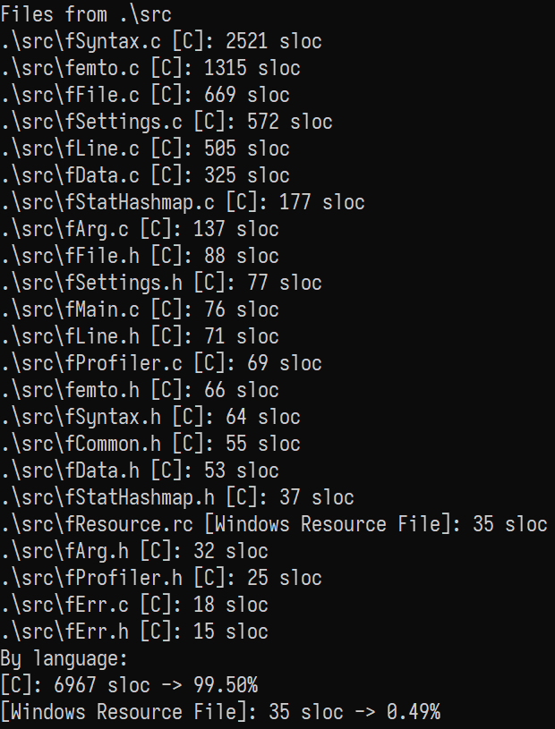
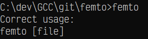
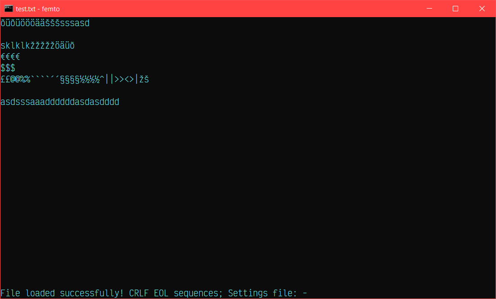
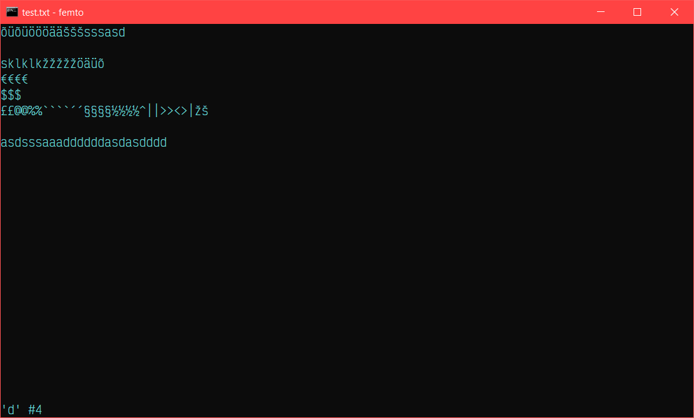
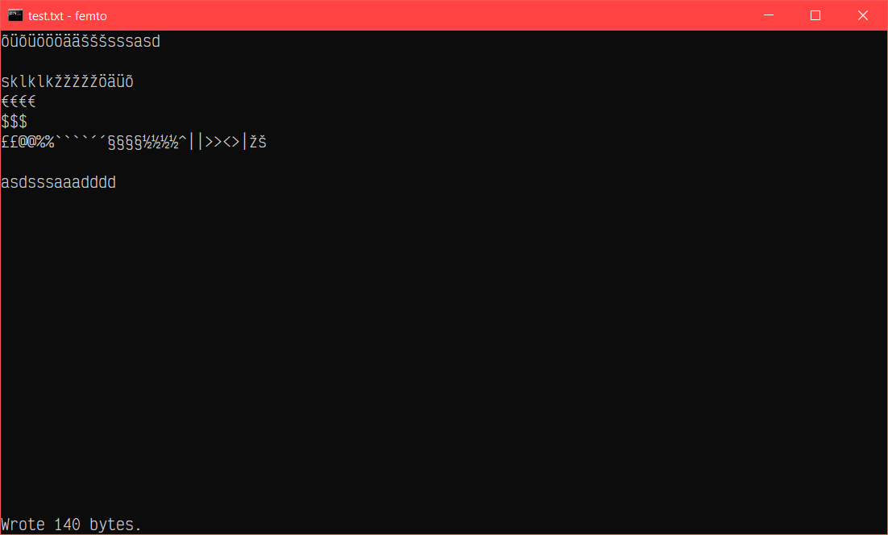

# femto

> Fully Equipped Minimal Text editOr - basically [atto](https://github.com/makuke1234/atto) on steroids

It is a bigger more feature-rich version of my other console text editor [atto](https://github.com/makuke1234/atto).
It is also written in vanilla C & Win32 Console API - it's designed to be used solely on Microsoft Windows.
It has been compiled with MinGW GCC.

Currently, my other tool [slocWin32](https://github.com/makuke1234/slocWin32)
reports ~3200 source code lines (excluding whitespace, comments & [jsonlite2](https://github.com/makuke1234/jsonlite2) library):

# Obtaining

32-bit (x86) & 64-bit (x64) Windows binaries can be obtained [here](https://github.com/makuke1234/femto/releases).

# Features

- [x] All saved files use CRLF line-ending format by default, LF and CR are also supported
	* *Editing text files is sublime*
- [x] The femto editor utilizes the whole command prompt window, window is as big as your console currently is
	* *As big as you like*
- [x] The last line of the window is dedicated to status, for example showing success or failure when an attempting to save a file
	* *You can see **exactly** what's going on*
- [x] Warns about any unsaved work
	* *Never lose your edits again*
- [ ] Search support & search results highlighting
- [ ] Syntax highlighting
- [x] Mouse scrolling, also horizontal scrolling
	* *Ever used a laptop's touchpad in the terminal **properly**?*
- [x] Mouse operated text cursor
	* *Click anywhere and it just works!*
- [x] Proper tab support, optional tabs-to-spaces, tab width adjustment
	* *Tabs are 4 spaces by default*
- [x] Automatic indentation, on by default
	* *The single best feature to speed up coding*
- [x] All settings can be given by command line arguments
	* *No settings file necessary*
- [x] Optional settings JSON file, can be named either `femto.json`, `femto-settings.json`, `femto_settings.json` or `settings.json`
    * *If multiple files exist with any of the names above, the settings file will be selected following this exact priority*
	* *Settings file modifies already given arguments only and only if they (settings from file) don't match the defaults*
	* *Settings file can be also given by command line arguments*
- [ ] Multi-file support
- [x] Optionally "visible" whitespace
	* *Never dismiss another 'tab'*
	* *Configurable color*
- [x] Keyboard shortcuts:
    | Key                            | Action                                        |
    | ------------------------------ | --------------------------------------------- |
    | <kbd>ESC</kbd>                 | Exit editor, ask to save any unsaved changes  |
	| <kbd>Ctrl+Q</kbd>              | Same as above                                 |
	| <kbd>Shift+ESC</kbd>           | Force exit editor                             |
    | <kbd>Ctrl+Shift+Q</kbd>        | Same as above                                 |
    | <kbd>Ctrl+N</kbd>              | Create new blank file                         |
    | <kbd>Ctrl+O</kbd>              | Open file                                     |
    | <kbd>Ctrl+S</kbd>              | Save file                                     |
    | <kbd>Ctrl+Shift+S</kbd>        | Save file as...                               |
    | <kbd>Ctrl+Tab</kbd>            | Switch forwards between open files            |
    | <kbd>Ctrl+Shift+Tab</kbd>      | Switch backwards between open files           |
    | <kbd>Ctrl+W</kbd>              | Close current tab                             |
    | <kbd>Ctrl+R</kbd>              | Reload current file contents                  |
    | <kbd>Ctrl+E</kbd> <kbd>F</kbd> | Switch to CRLF EOL sequence                   |
    | <kbd>Ctrl+E</kbd> <kbd>L</kbd> | Switch to LF EOL sequence                     |
    | <kbd>Ctrl+E</kbd> <kbd>C</kbd> | Switch to CR EOL sequence                     |
    | <kbd>Shift+DEL</kbd>           | Delete whole line                             |
    | <kbd>Alt+DEL</kbd>             | Delete whole line                             |
    | <kbd>PgUp</kbd>                | Scroll whole screen-buffer worth of text up   |
    | <kbd>PgDown</kbd>              | Scroll whole screen-buffer worth of text down |
    | <kbd>Home</kbd>                | Move to the begginning of the line            |
    | <kbd>End</kbd>                 | Move to the end of the line                   |
    | <kbd>Alt+Up</kbd>              | Move current line up                          |
    | <kbd>Alt+Down</kbd>            | Move current line down                        |
- [x] Ways to start the editor:
    | Syntax                              | Action                                                                                                  |
    | ----------------------------------- | ------------------------------------------------------------------------------------------------------- |
    | `femto` \[options\]                 | Starts editor with empty file                                                                           |
    | `femto` \[options\] \[file\]        | Starts editor with the specified file, does not have to exist *where \[file\] is the file's name* |
    | `femto` \[options\] --file=\[file\] | Same as above, just a different syntax                                                                  |
    | `femto` --help                      | Shows help                                                           |
- [x] About options:
    * Basic option syntax:
        *   | Syntax         | Description           |
            | -------------- | --------------------- |
            | `--`\[option\] | Just selects the flag |
            | `-`\[option\]  | Same as above         |
            | `/`\[option\]  | Same as above         |
    * Option arguments (note that the `--` before option can be replaced following the pattern in the above table):
        * `--`\[option\]`=`\[argument 1\]`,`\[argument 2\]`,`\[argument 3\]
    * Also note that the number of arguments to be passed is variable, depending on the option
    * There is also an alternate syntax for passing arguments:
        * `--`\[option\]`=`\[argument 1\]`;`\[argument 2\]`;`\[argument 3\]
    * A question mark can also be used as a separator:
        * `--`\[option\]`=`\[argument 1\]`?`\[argument 2\]`?`\[argument 3\]
- [x] List of options:
    | Option                        | Description                                         |
    | ----------------------------- | --------------------------------------------------- |
    | --help                        | Shows help                                          |
    | --file=\[file\]               | Specifies file name to open                         |
    | \[file\]                      | Same as above, must be given as the last argument   |
    | --settings=\[file\]           | Specify custom settings file explicitly             |
    | --setting=\[file\]            | Same as above                                       |
    | --tabsSpaces=\[value\]        | Value can be either true/false or 1/0               |
    | --tabsToSpaces=\[value\]      | Same as above                                       |
    | --tabWidth=\[value\]          | Value can be any number from 1-32 (inclusive)       |
    | --tabw=\[value\]              | Same as above                                       |
    | --autoIndent=\[value\]        | Value can be either true/false or 1/0               |
    | --autoI=\[value\]             | Same as above                                       |
    | --aIndent=\[value\]           | Same as above                                       |
    | --whitespaceVisible=\[value\] | Value can be either true/false or 1/0               |
    | --visibleWhitespace=\[value\] | Same as above                                       |
    | --whitespaceCh=\[value\]      | Specifies "visible" whitespace character to be used |
    | --whitespaceColor=\[value\]   | Specifies whitespace color, number between 0-65535  |
    | --whitespaceCol=\[value\]     | Same as above                                       |
- [x] List of settings:
    | Setting           | Type    |
    | ----------------- | ------- |
    | tabsToSpaces      | boolean |
    | tabWidth          | number  |
    | autoIndent        | boolean |
    | whitespaceVisible | boolean |
    | whitespaceCh      | string  |
	| whitespaceColor   | number  |

# Screenshots

## Demonstrating unicode support, file test.txt is open with CRLF EOL sequences

## Last key shown on status bar with respective repeat count

## Saving was successful, file size is now 151 bytes

# Changelog

* 1.4 (planned)
    * [ ] Line numbers, absolute & relative mode
    * [x] Warning about any unsaved work
    * [ ] Practical multi-file support
    * [ ] Search support, also search result highlighting
    * [ ] Syntax highlighting, supported languages:
        * [ ] C
        * [ ] C++
        * [ ] Markdown
    * [ ] Proper text copying/pasting support
        * *Copying is already implicitly supported by the console itself, although limited to only 1 screenbuffer at a time*
    * [ ] 'Raw editing'/'saving later to a file' support
    * [x] Optionally "visible" whitespace
    * [x] Configurable whitespace color
* 1.3
    * [x] Primitive tab support
    * [x] Proper tab support
    * [x] Tab support for cursor selection with mouse
    * [x] Tab support when scrolling horizontally
* 1.2
    * [x] Proper setting loading from file
    * [x] Built-in hashmap support
    * [x] Built-in JSON support
    * [x] Tweak key behaviour, Ctrl+E doesn't have to be immediately released anymore
    * [x] Add placeholders for planned keyboard shortcuts
* 1.1
    * [x] Automatic indentation, turned on by default, new settings
    * [x] Command line argument parsing support
    * [x] Proper command line argument handling
    * [x] Optional settings file
    * [x] Optional tabs-to-spaces, tab width adjustment
    * [x] Tweak keypress status messages
    * [x] Refactor/optimise codebase using same optimisations applied to [atto](https://github.com/makuke1234/atto)
    * [x] Optimise screen buffer updating frequency on keyboard/mouse input
    * [x] Only update line that's being edited, if viewport doesn't change
    * [x] Refactor, check all pointers in debug mode
    * [x] Tweak status messages, optimise for clarity, minimise redundant punctuation
* 1.0
    * [x] Theoretical multi-file support
    * [x] Mouse scrolling support
    * [x] Horizontal scrolling support
    * [x] Mouse support for controlling the cursor
    * [x] Color rendering support
        * *Changed the foreground color to cyan*
    * [x] Scrolling whole screen worth of text with page up & page down
    * [x] Moving cursor to the beggining/end of line with home/end
    * [x] Whole line deletion
    * [x] Line moving
    * [x] Better cursor movement when using left/right arrows between lines
    * [x] Better cursor movement when using up/down arrows between lines
* 0.1
    * [x] Initial release, basically a copy of [atto](https://github.com/makuke1234/atto)

# Contributing

This project is by no means perfect. Feel free to report any bugs, that you may find, under
**[Issues](https://github.com/makuke1234/femto/issues)**.
Also feel free to make any feature requests that come into your mind. Currently our end goal
is to achieve an editor that's comfortable to use. Please be patient though because my first
priorities are bug fixing and implementing pre-planned [features](#Features). For more savvy
users, the [changelog](#Changelog) may be more useful to keep track of the progress.

# License

This project is using the MIT license.

