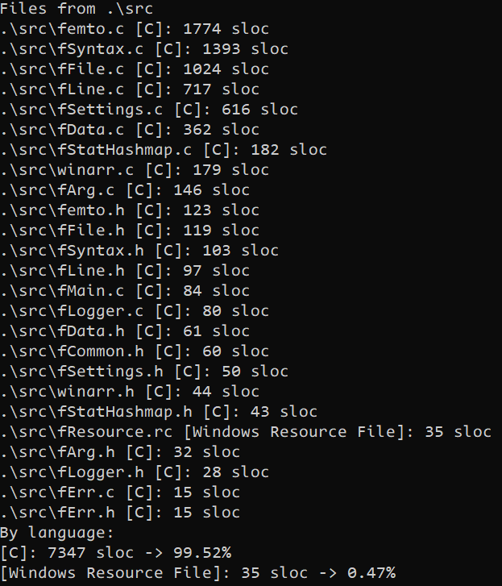
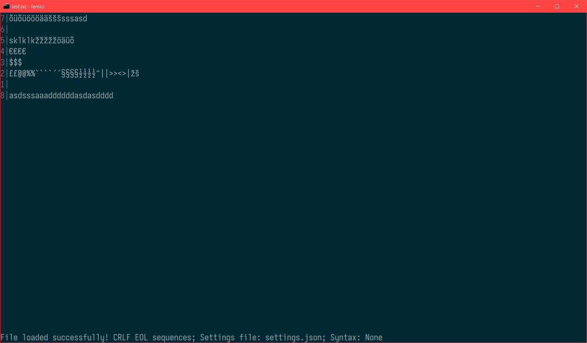
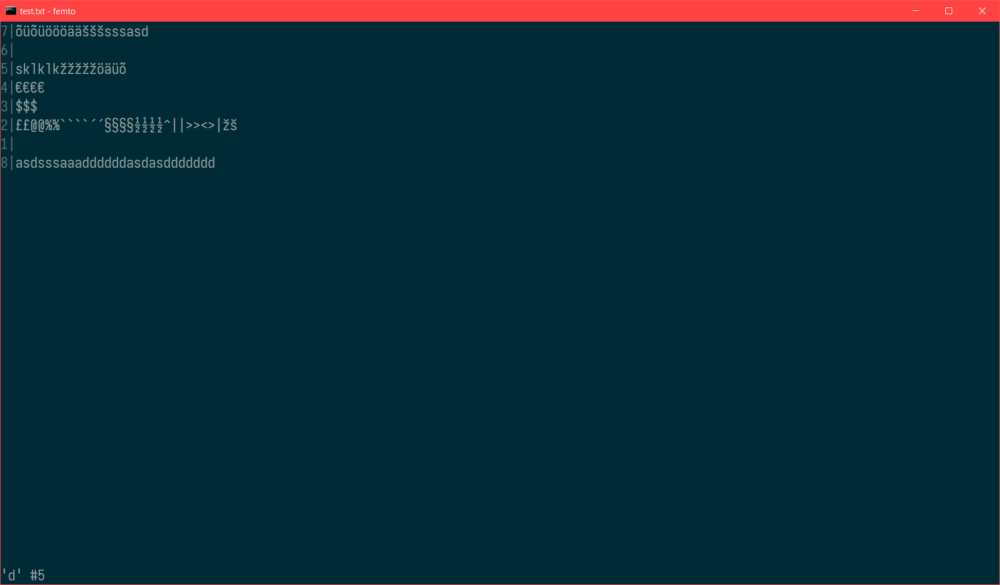
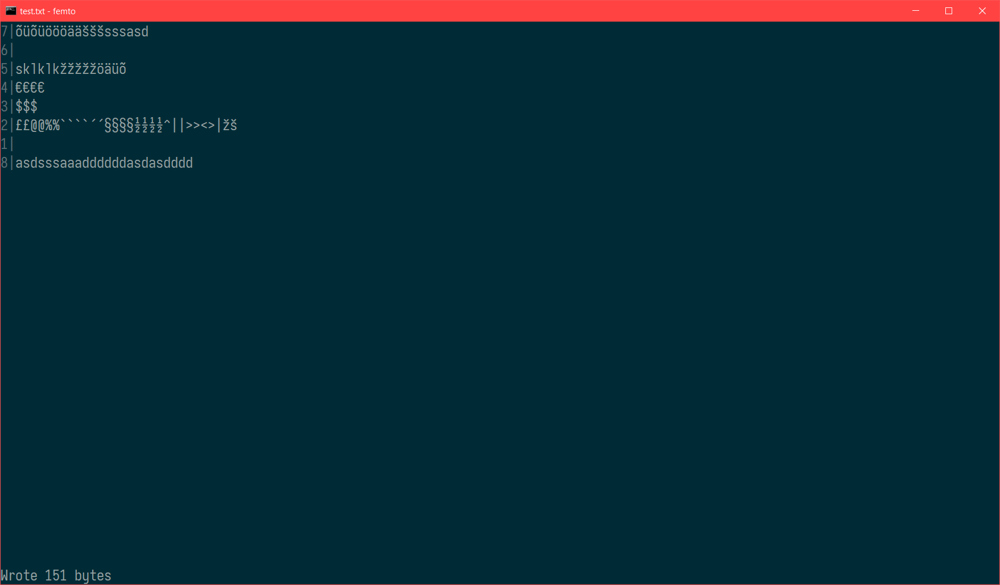

# femto

> Fully Equipped Minimal Text editOr

It is a bigger more feature-rich version of my other console text editor [atto](https://github.com/makuke1234/atto).
It is also written in vanilla C + Win32 Console API - it's designed to be used solely in Microsoft Windows.
It has been compiled with MinGW GCC.

Currently, my other tool [slocWin32](https://github.com/makuke1234/slocWin32) reports 1665 lines of code for this editor:

# Obtaining

32-bit (x86) & 64-bit (x64) Windows binaries can be obtained [here](https://github.com/makuke1234/femto/releases).

# Features

- [x] all saved files use CRLF line-ending format by default, LF and CR are also supported
- [x] femto editor utilizes the whole command prompt window, window is as big as your console currently is
- [x] the last line of the window is dedicated to status, for example showing success or failure when an attempting to save a file
- [ ] search results highlighting
- [ ] syntax highlighting
- [ ] mouse scrolling
- [ ] proper tab support, optional tabs-to-spaces, tab width adjustment, by default tab is 4 spaces
- [ ] optional settings JSON file, can be named either `femto.json`, `femto-settings.json`, `femto_settings.json` or `settings.json`
    * *If multiple files exist with any of the names above, the settings file would be preferred with the priority order above*
- [ ] all settings can be given by command line arguments
- [ ] multi-file support
- [x] keyboard shortcuts:
    | Key                            | Action                                        |
    | ------------------------------ | --------------------------------------------- |
    | <kbd>ESC</kbd>                 | Exit editor                                   |
    | <kbd>Ctrl+Q</kbd>              | Exit editor                                   |
    | [ ] <kbd>Ctrl+N</kbd>          | Create new blank file                         |
    | [ ] <kbd>Ctrl+O</kbd>          | Open file                                     |
    | <kbd>Ctrl+S</kbd>              | Safe file                                     |
    | [ ] <kbd>Ctrl+Shift+S</kbd>    | Save file as...                               |
    | [ ] <kbd>Ctrl+Tab</kbd>        | Switch forwards between open files            |
    | [ ] <kbd>Ctrl+Shift+Tab</kbd>  | Switch backwards between open files           |
    | <kbd>Ctrl+R</kbd>              | Reload current file contents                  |
    | <kbd>Ctrl+E</kbd> <kbd>F</kbd> | Switch to CRLF EOL sequence                   |
    | <kbd>Ctrl+E</kbd> <kbd>L</kbd> | Switch to LF EOL sequence                     |
    | <kbd>Ctrl+E</kbd> <kbd>C</kbd> | Switch to CR EOL sequence                     |
    | [ ] <kbd>Shift+DEL</kbd>       | Delete whole line                             |
    | [ ] <kbd>Alt+DEL</kbd>         | Delete whole line                             |
    | [ ] <kbd>PgUp</kbd>            | Scroll whole screen-buffer worth of text up   |
    | [ ] <kbd>PgDown</kbd>          | Scroll whole screen-buffer worth of text down |
    | [ ] <kbd>Home</kbd>            | Move to the begginning of the line            |
    | [ ] <kbd>End</kbd>             | Move to the end of the line                   |
    | [ ] <kbd>Alt+Up</kbd>          | Move current line up                          |
    | [ ] <kbd>Alt+Down</kbd>        | Move current line down                        |
- [x] ways to start the editor:
    | Syntax                       | Action                                                                                                  |
    | ---------------------------- | ------------------------------------------------------------------------------------------------------- |
    | `femto` \[options\]          | Starts editor with empty file                                                                           |
    | `femto` \[options\] \[file\] | Starts editor with the specified file, does not have to exist *where \[file\] is the file's name* |
    | `femto` --help               | Shows help                                                           |

# Screenshots

## Demonstrating unicode support, file test5.txt is open with LF EOL sequences

## Last key shown on status bar with respective repeat count

## Saving was successful, file size is now 48 bytes

# Changelog

* 1.1 (planned)
    * [ ] Practical multi-file support
    * [ ] Search support, also search result highlighting
    * [ ] Syntax highlighting, supported languages:
        * [ ] C
        * [ ] C++
        * [ ] Markdown
    * [ ] Text pasting support
        * *Copying is implicitly supported by the console itself, although limited to only 1 screenbuffer at a time*
    * [ ] Proper command line program argument handling, optional settings file
    * [ ] Optional tabs-to-spaces, tab width adjustment
    * [ ] 'Raw editing'/'saving later to a file' support
    * [ ] Warning when there's any unsaved work

* 1.0 (planned)
    * [x] Theoretical multi-file support
    * [x] Mouse scrolling support
    * [ ] Color rendering support
    * [ ] Scrolling whole screen worth of text with page up & page down
    * [ ] Moving cursor to the beggining/end of line with home/end
    * [ ] Line numbers, absolute & relative mode
    * [ ] Whole line deletion
    * [ ] Better cursor movement when using left/right arrows between lines
    * [ ] Better cursor movement when using up/down arrows between lines
* 0.1
    * Initial release, basically a copy of [femto](https://github.com/makuke1234/atto)

# License

This project is using the MIT license.
