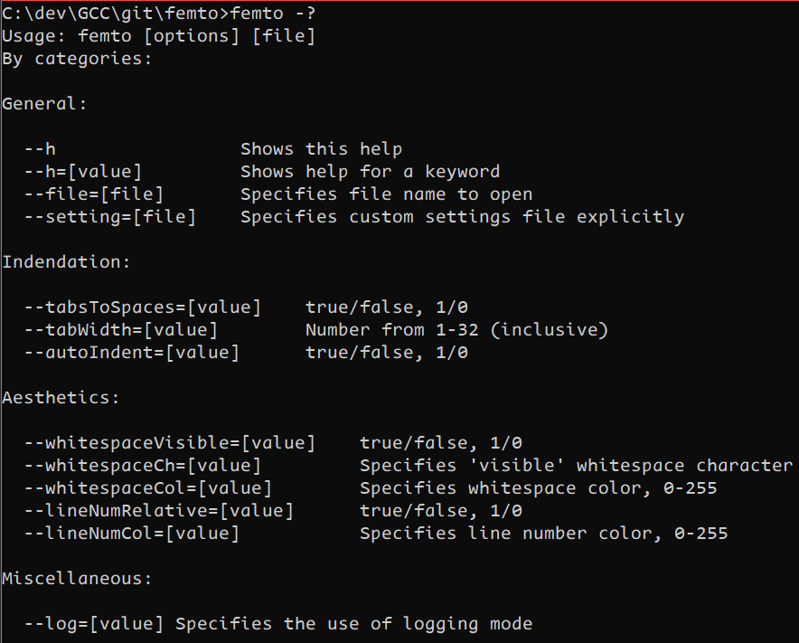
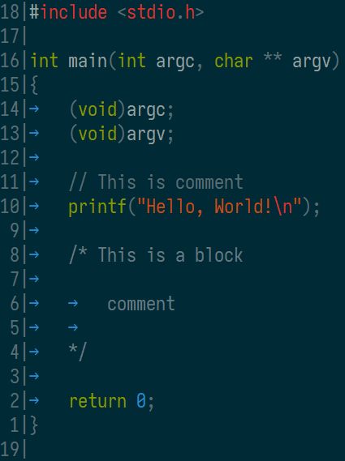
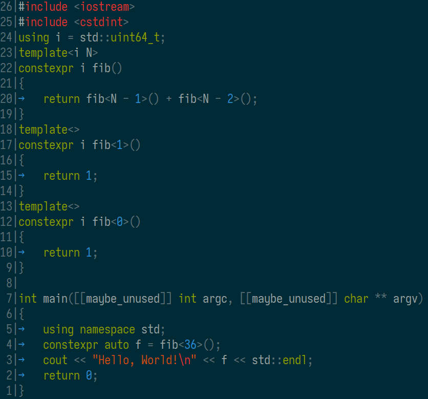
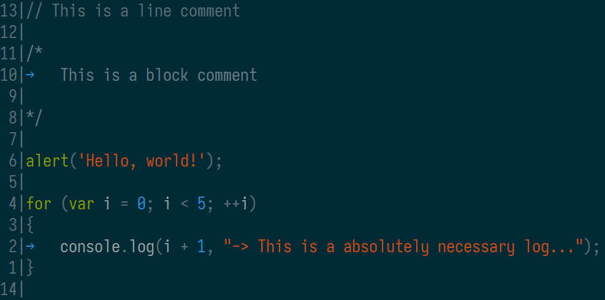
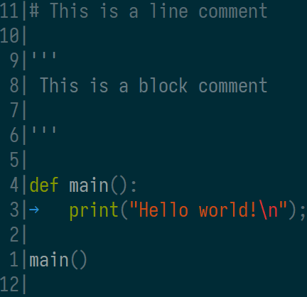
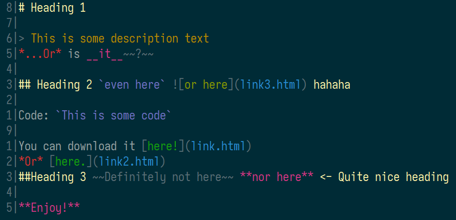
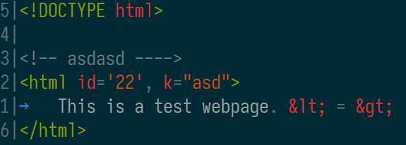
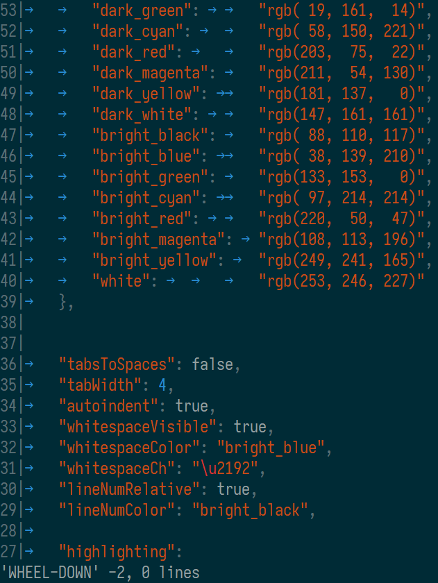

# femto

> Fully Equipped Minimal Text editOr - basically [atto](https://github.com/makuke1234/atto) on steroids

It is a bigger more feature-rich version of my other console text editor [atto](https://github.com/makuke1234/atto).
It is also written in vanilla C & Win32 Console API - it's designed to be used solely on Microsoft Windows.
It has been compiled with MinGW GCC.

Currently, my other tool [slocWin32](https://github.com/makuke1234/slocWin32)
reports ~7200 source code lines (excluding whitespace, comments, language keywords & [jsonlite2](https://github.com/makuke1234/jsonlite2) library):

# Obtaining

64-bit (x64) Windows binaries can be obtained [here](https://github.com/makuke1234/femto/releases).

# Features

- [x] Built-in copy-pasting support
- [x] All saved files use CRLF line-ending format by default, LF and CR are also supported
	* *Editing text files is sublime*
- [x] The femto editor utilizes the whole command prompt window, window is as big as your console currently is
	* *As big as you like*
- [x] The last line of the window is dedicated to status, for example showing success or failure when an attempting to save a file
	* *You can see **exactly** what's going on*
- [x] Warns about any unsaved work
	* *Never lose your edits again*
- [x] Search support & result highlighting
	* *Use F2 & F3 to go backwards or forwards between results*
- [x] Syntax highlighting
	* *Every token configurable*
	* *Configurable color palette*
	* *Foreground and background*
- [x] Mouse scrolling, also horizontal scrolling
	* *Ever used a laptop's touchpad in the terminal **properly**?*
- [x] Mouse operated text cursor
	* *Click anywhere and it just works!*
- [x] Proper tab support, optional tabs-to-spaces, tab width adjustment
	* *Tabs are 4 spaces by default*
- [x] Automatic indentation, on by default
	* *The single best feature to speed up coding*
- [x] All settings can be given by command line arguments
	* *No settings file necessary*
- [x] Optional settings JSON file, can be named either `femto.json`, `femto-settings.json`, `femto_settings.json` or `settings.json`
	* *If multiple files exist with any of the names above, the settings file will be selected following this exact priority*
	* *Settings file modifies already given arguments only and only if they (settings from file) don't match the defaults*
	* *Settings file can be also given by command line arguments*
- [x] Multi-file support
- [x] Optionally "visible" whitespace
	* *Never dismiss another 'tab'*
	* *Configurable color*
- [x] Keyboard shortcuts:
	| Key                            | Action                                        |
	| ------------------------------ | --------------------------------------------- |
	| <kbd>ESC</kbd>                 | Exit editor, ask to save any unsaved changes  |
	| <kbd>Ctrl+Q</kbd>              | Same as above                                 |
	| <kbd>Shift+ESC</kbd>           | Force exit editor                             |
	| <kbd>Ctrl+Shift+Q</kbd>        | Same as above                                 |
	| <kbd>Ctrl+X</kbd>              | Cut                                           |
	| <kbd>Ctrl+C</kbd>              | Copy                                          |
	| <kbd>Ctrl+V</kbd>              | Paste                                         |
	| <kbd>Ctrl+N</kbd>              | Create new blank file                         |
	| <kbd>Ctrl+O</kbd>              | Open file                                     |
	| <kbd>Ctrl+S</kbd>              | Save file                                     |
	| <kbd>Ctrl+Shift+S</kbd>        | Save file as...                               |
	| <kbd>Ctrl+Tab</kbd>            | Switch forwards between open files            |
	| <kbd>Ctrl+Shift+Tab</kbd>      | Switch backwards between open files           |
	| <kbd>Ctrl+W</kbd>              | Close current tab, ask to save any changes    |
	| <kbd>Ctrl+Shift+W</kbd>        | Force close current tab                       |
	| <kbd>Ctrl+R</kbd>              | Reload current file, ask to save changes      |
	| <kbd>Ctrl+Shift+R</kbd>        | Force reload current file                     |
	| <kbd>Ctrl+F</kbd>              | Find a phrase from cursor forward             |
	| <kbd>F2</kbd>                  | Highlight another phrase backward             |
	| <kbd>F3</kbd>                  | Highlight another phrase forward              |
	| <kbd>Shift+ARROW</kbd>         | Highlight text                                |
	| <kbd>Ctrl+E</kbd> <kbd>F</kbd> | Switch to CRLF EOL sequence                   |
	| <kbd>Ctrl+E</kbd> <kbd>L</kbd> | Switch to LF EOL sequence                     |
	| <kbd>Ctrl+E</kbd> <kbd>C</kbd> | Switch to CR EOL sequence                     |
	| <kbd>Shift+DEL</kbd>           | Delete whole line                             |
	| <kbd>Alt+DEL</kbd>             | Delete whole line                             |
	| <kbd>PgUp</kbd>                | Scroll whole screen-buffer worth of text up   |
	| <kbd>PgDown</kbd>              | Scroll whole screen-buffer worth of text down |
	| <kbd>Home</kbd>                | Move to the begginning of the line            |
	| <kbd>End</kbd>                 | Move to the end of the line                   |
	| <kbd>Alt+Up</kbd>              | Move current line up                          |
	| <kbd>Alt+Down</kbd>            | Move current line down                        |
- [x] Ways to start the editor:
	| Syntax                              | Action                                                                                                  |
	| ----------------------------------- | ------------------------------------------------------------------------------------------------------- |
	| `femto` \[options\]                 | Starts editor with empty file                                                                           |
	| `femto` \[options\] \[file\]        | Starts editor with the specified file, does not have to exist *where \[file\] is the file's name* |
	| `femto` \[options\] --file=\[file\] | Same as above, just a different syntax                                                                  |
	| `femto` --help                      | Shows help                                                           |
- [x] Command-line options:
	* Basic option syntax:
		*	| Syntax         | Description           |
			| -------------- | --------------------- |
			| `--`\[option\] | Just selects the flag |
			| `-`\[option\]  | Same as above         |
			| `/`\[option\]  | Same as above         |
	* Option arguments (note that the `--` before option can be replaced following the pattern in the above table):
		* `--`\[option\]`=`\[argument 1\]`,`\[argument 2\]`,`\[argument 3\]
	* Also note that the number of arguments to be passed is variable, depending on the option
	* There is also an alternate syntax for passing arguments:
		* `--`\[option\]`=`\[argument 1\]`;`\[argument 2\]`;`\[argument 3\]
	* A question mark can also be used as a separator:
		* `--`\[option\]`=`\[argument 1\]`?`\[argument 2\]`?`\[argument 3\]
- [x] Option list:
  * *In this table, only a bare minimum of the possible argument strings is written, any argument can contain any*
	*number of extra characters at the end for example `--h` shows help but so does `--help` or `--hasdhhfsdfugsdfgj`.*
	*Another example would be `--set=settings.json`, so is valid `--setsas_d_j-hdakjgasd123123AAAfjahsdf=settings.json`.*
  * | Option                        | Description                                         |
	| ----------------------------- | --------------------------------------------------- |
	| --h                           | Same as above                                       |
	| --?                           | Same as above                                       |
	| --h=\[keyword\]               | Shows help according to the specified keyword       |
	| --f=\[file\]                  | Specifies file name to open                         |
	| \[file\]                      | Same as above, must be given as the last argument   |
	| --set=\[file\]                | Specify custom settings file explicitly             |
	| --tabsS=\[value\]             | Value can be either true/false or 1/0               |
	| --tabsToS=\[value\]           | Same as above                                       |
	| --tabw=\[value\]              | Value can be any number from 1-32 (inclusive)       |
	| --autoI=\[value\]             | Value can be either true/false or 1/0               |
	| --aIndent=\[value\]           | Same as above                                       |
	| --whitespaceVis=\[value\]     | Value can be either true/false or 1/0               |
	| --wsVis=\[value\]             | Same as above                                       |
	| --vis=\[value\]               | Same as above                                       |
	| --whitespaceCh=\[value\]      | Specifies "visible" whitespace character to be used |
	| --wsCh=\[value\]              | Same as above                                       |
	| --whitespaceCol=\[value\]     | Specifies whitespace color, number between 0-255    |
	| --wsCol=\[value\]             | Same as above                                       |
	| --lineNumRel=\[value\]        | Value can be either true/false or 1/0               |
	| --lineNumCol=\[value\]        | Specifies line number color, number between 0-255   |
	| --log=\[value\]               | Specifies whether logging mode is enabled           |
- [x] List of settings:
	| Setting             | Type    |
	| ------------------- | ------- |
	| tabsToSpaces        | boolean |
	| tabWidth            | number  |
	| autoIndent          | boolean |
	| whitespaceVisible   | boolean |
	| whitespaceCh        | string  |
	| whitespaceColor     | number  |
	| lineNumRelative     | boolean |
	| lineNumColor        | number  |
	| logging             | boolean |
	| palette             | object  |
	| highlighting        | object  |

Have a look at the provided [settings file](./settings.json) to get a better understanding of the different settings.

# Screenshots

## Unicode support, CRLF end-of-line sequences

## Last key shown on status bar with respective repeat count

## Saving was successful, file size is now 151 bytes

## Syntax highlighting, solarized theme, included in `settings.json`
### C

### C++

### Rust

### Go (Golang)

### ECMAScript (JavaScript)

### Python

### Markdown

### XML

### HTML

### JSON

### CSS

# Changelog

* 2.3 (planned)
	* [x] More advanced program help, supports keywords
	* [ ] Advanced theming support, load themes from separate files
	* [ ] Advanced undo/redo, choose which way to redo

* 2.2.1
	* [x] Fix bug that tabs' system doesn't work
	* [x] Dropped 32-bit (x86) support, you can still compile it yourself :)

* 2.2
	* [x] Fix bug that editor sometimes crashes on Shift+Tab
	* [x] Document winarr structure implementation & enforce `restrict` pointers
	* [x] Add logging mode as a command-line option + setting in settings.json
	* [x] Change logging destination file to `femto.log`
	* [x] Better logging in debug mode

* 2.1
	* [x] Pointer checking in every function
	* [x] Text highlighting using keyboard & mouse
	* [x] Proper text copying/pasting support
	* [x] Port codebase to use universal integer sizes `size_t` & `ssize_t` (signed)
	* [x] Properly fixed search functionality

* 2.0
	* [x] More common C++ keywords
	* [x] Support for raw editing/saving later to a file
	* [x] Proper new tab creation with <kbd>Ctrl+N</kbd>
	* [x] Now titlebar name also changes while switching between tabs
	* [x] Search support, also search result highlighting

* 1.9
	* [x] Fix immediate empty file creation if file doesn't exist
	* [x] Add Go syntax support
	* [x] Add Rust syntax highlighting support
	* [x] Fix weird syntax highlighting with numbers
	* [x] Notify about unknown key combination
	* [x] Another way to specify RGB values -> e.g #1234ff
	* [x] Background color customization support
	* [x] Fix lag on status-bar input

* 1.8
	* [x] Add horizontal scrolling support while holding the <kbd>Shift</kbd> key
	* [x] Practical multi-file support, tabs' system
	* [x] Switching between tabs
	* [x] Application signature (file meta-info)
	* [x] Unique icon

* 1.7.1
	* [x] More syntax highlighting
		* [x] Python
		* [x] ECMAScript (JavaScript)
		* [x] CSS
		* [x] XML-like
			* [x] HTML

* 1.7
	* [x] Syntax highlighting customisable
	* [x] More language support
		* [x] JSON
		* [x] XML-like
			* [x] XML
			* [x] SVG
	* [x] Custom color palette
	* [x] Possibility to delete last line
	* [x] Fix crash when deleting first line

* 1.6
	* [x] Fix indentation bug
	* [x] Save-as support
	* [x] Allow multiple sequential file opens
	* [x] Syntax highlighting, supported languages:
		* [x] C
		* [x] C++
		* [x] Markdown
	* [x] Asynchronous drawing
	* [x] Micro-optimisations in codebase

* 1.5
	* [x] Asks for user input on open & save as
	* [x] User input support on the last line of the editor
	* [x] Fix auto-indentation bug, inserts too many tabs
	* [x] Fix backwards tabbing (space removal)

* 1.4
	* [x] Line numbers, absolute & relative mode
	* [x] Warning about any unsaved work
	* [x] Optionally "visible" whitespace
	* [x] Configurable whitespace color

* 1.3
	* [x] Primitive tab support
	* [x] Proper tab support
	* [x] Tab support for cursor selection with mouse
	* [x] Tab support when scrolling horizontally

* 1.2
	* [x] Proper setting loading from file
	* [x] Built-in hashmap support
	* [x] Built-in JSON support
	* [x] Tweak key behaviour, Ctrl+E doesn't have to be immediately released anymore
	* [x] Add placeholders for planned keyboard shortcuts

* 1.1
	* [x] Automatic indentation, turned on by default, new settings
	* [x] Command line argument parsing support
	* [x] Proper command line argument handling
	* [x] Optional settings file
	* [x] Optional tabs-to-spaces, tab width adjustment
	* [x] Tweak keypress status messages
	* [x] Refactor/optimise codebase using same optimisations applied to [atto](https://github.com/makuke1234/atto)
	* [x] Optimise screen buffer updating frequency on keyboard/mouse input
	* [x] Only update the line that's being edited
	* [x] Refactor, check all pointers in debug mode
	* [x] Tweak status messages, optimise for clarity, minimise redundant punctuation

* 1.0
	* [x] Theoretical multi-file support
	* [x] Mouse scrolling support
	* [x] Horizontal scrolling support
	* [x] Mouse support for controlling the cursor
	* [x] Color rendering support
		* *Changed the foreground color to cyan*
	* [x] Scrolling whole screen worth of text with page up & page down
	* [x] Moving cursor to the beggining/end of line with home/end
	* [x] Whole line deletion
	* [x] Line moving
	* [x] Better cursor movement when using left/right arrows between lines
	* [x] Better cursor movement when using up/down arrows between lines

* 0.1
	* [x] Initial release, basically a copy of [atto](https://github.com/makuke1234/atto)

# Contributing

This project is by no means perfect. Feel free to report any bugs, that you may find, under
**[Issues](https://github.com/makuke1234/femto/issues)**.
Also feel free to make any feature requests that come into your mind. Currently our end goal
is to achieve an editor that's comfortable to use. Please be patient though because my first
priorities are bug fixing and implementing pre-planned [features](#Features). For more savvy
users, the [changelog](#Changelog) may be more useful to keep track of the progress.

# License

This project is using the MIT license.

<a href="https://www.flaticon.com/free-icons/text-editor" title="text editor icons">Text editor icons created by Noor Hakim - Flaticon</a>
